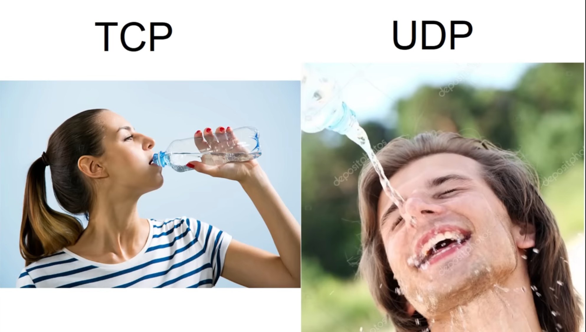
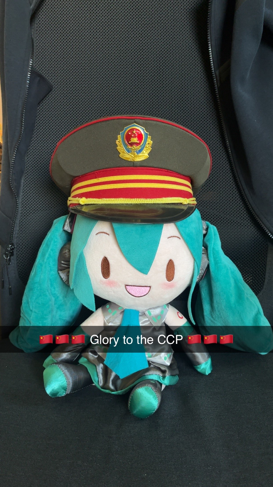

## This users coding skill downfall has to be studied

```text
    ___   _   _    ___    _  __                      ___   
   | __| | | | |  / __|  | |/ /     o O O    o O O  / __|  
   | _|  | |_| | | (__   | ' <     o        o      | (__   
  _|_|_   \___/   \___|  |_|\_\   TS__[O]  TS__[O]  \___|  
_| """ |_|"""""|_|"""""|_|"""""| {======| {======|_|"""""| 
"`-0-0-'"`-0-0-'"`-0-0-'"`-0-0-'./o--000'./o--000'"`-0-0-' 
```


<details>
    <summary><h1>Pictures i fw heavy ⤵</h1></summary>
<div align="center">

  

  

  

  

  

  

  

  

  

  

  

  

  

  
</div>
</details>

<details>
    <summary><h2>LBDT License</h2></summary>
<div>
    
# The Look-But-Don't-Touch License (LBDT License)  
*Version 2.0*

Copyright (c) [2025] [Maximilian]

---

## 1. Preamble  
This software is provided solely for the purpose of non-functional, non-interactive, and non-utilitarian observation.  
It is to be regarded as a static digital artifact—akin to visual art displayed in a gallery.

---

## 2. Grant of Rights  

Permission is granted to any individual to:

- Access and view the source code in its unaltered form.

**No other rights are granted.** The following actions are **expressly prohibited**:

- Executing, compiling, or otherwise running the software  
- Copying, modifying, or creating derivative works based on the software  
- Redistributing the software in whole or in part  
- Using the software, in any form, for commercial, educational, or private purposes  
- Incorporating any portion of the software into other projects, products, or codebases

---

## 3. No License for Use  
This license does **not** constitute a software usage license.  
It is a **viewing license only**. Any use beyond passive observation is considered a violation of this agreement.

---

## 4. Intellectual Property  
The entirety of this code remains the sole intellectual property of the original author.  
No rights of ownership, usage, or transfer are conferred under this license.

---

## 5. Analogy Clause  
This software is to be treated as a work of visual art in a museum:  
It may be observed, contemplated, and discussed but not interacted with, reproduced, or removed from its intended context.

---

## 6. Commercial Exception Clause  
A commercial or functional use license **may** be granted **upon payment** to the author.  
Such payment is subject to prior negotiation and will depend on the **complexity and scope** of the software in question.

**No offers, payments, or assumptions of rights are valid** unless expressly agreed to in writing by the author in advance.  

---
</div>
</details>


<!--
**Walnusskeim/Walnusskeim** is a ✨ _special_ ✨ repository because its `README.md` (this file) appears on your GitHub profile.

Here are some ideas to get you started:

- 🔭 I’m currently working on ...
- 🌱 I’m currently learning ...
- 👯 I’m looking to collaborate on ...
- 🤔 I’m looking for help with ...
- 💬 Ask me about ...
- 📫 How to reach me: ...
- 😄 Pronouns: ...
- ⚡ Fun fact: ...
-->
