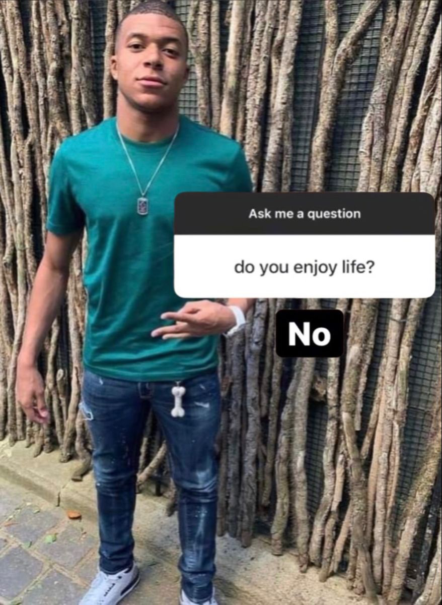

<div align="center">

## This users coding skill downfall has to be studied

### Searching for an actually *good* license? 
### 👉 lbdt-license.wiki 👈

<h6>Grinding Assembly because it will be my main language (I hate my life (real))</h6>

</div>


```text
    ___   _   _    ___    _  __                      ___   
   | __| | | | |  / __|  | |/ /     o O O    o O O  / __|  
   | _|  | |_| | | (__   | ' <     o        o      | (__   
  _|_|_   \___/   \___|  |_|\_\   TS__[O]  TS__[O]  \___|  
_| """ |_|"""""|_|"""""|_|"""""| {======| {======|_|"""""| 
"`-0-0-'"`-0-0-'"`-0-0-'"`-0-0-'./o--000'./o--000'"`-0-0-' 
```


<details>
    <summary><h1>Pictures i fw heavy ⤵</h1></summary>
<div align="center">

  

  

  

  

  

  

  

  

  

  

  

  

  

  

  

  
</div>
</details>

<details>
    <summary><h1>MY ANGEL MAFUYU 💜</h1></summary>
<div align="center">

If Mafuyu has a million fans, I am one of them

If Mafuyu has 10 fans, I am one of them

If Mafuyu has 1 fan, that one is me

If Mafuyu has no fans, I am no longer alive

If the world is against Mafuyu, I am against the entire world

Till my last breath I'll support Mafuyu!


    


</div>
</details>

<details>
    <summary><h1>SONG OF THE WEEK 🎵</h1></summary>
<div align="center">

## This is where I show songs, that were the main theme of the week.

<details>
    <summary><h3>KW 20 (12.05.2025 - 18.05.2025)</h3></summary>
<div align="center">
    
### Adventure Of A Lifetime - Coldplay (2015)

https://github.com/user-attachments/assets/835a7dbf-284b-4d02-925e-b462fd26a879

</div>
</details>


</div>
</details>

<!--
**Walnusskeim/Walnusskeim** is a ✨ _special_ ✨ repository because its `README.md` (this file) appears on your GitHub profile.

Here are some ideas to get you started:

- 🔭 I’m currently working on ...
- 🌱 I’m currently learning ...
- 👯 I’m looking to collaborate on ...
- 🤔 I’m looking for help with ...
- 💬 Ask me about ...
- 📫 How to reach me: ...
- 😄 Pronouns: ...
- ⚡ Fun fact: ...
-->
